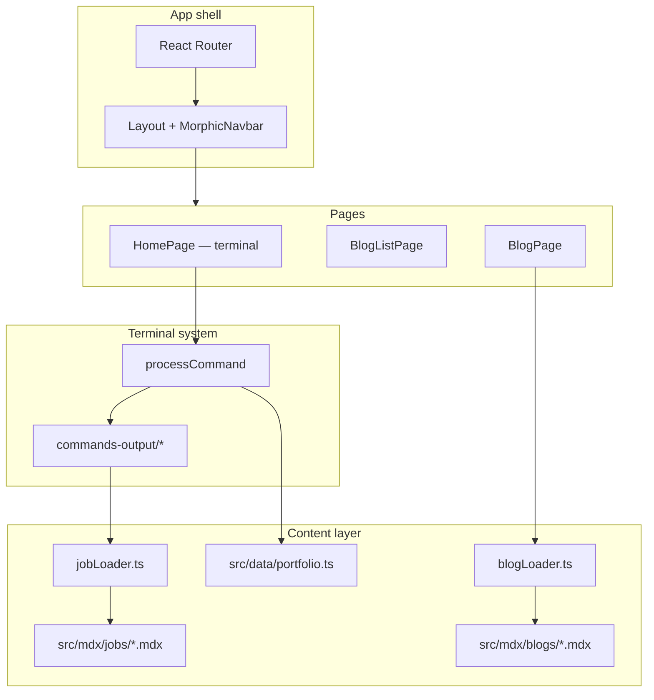

# bgramaje-portfolio-v2 — Agent Guide

Personal portfolio for Borja Gramaje. The home page is an interactive terminal; blog posts and job details are MDX content loaded at build time. Deployed as a static SPA on GitHub Pages.

> **Audience:** AI agents and LLMs maintaining or extending this repo. Humans may use it too, but it is optimized for automation.

---

## Quick facts

| Item | Value |
|------|-------|
| Runtime | Browser-only SPA — **no server, no API routes, no SSR** |
| Framework | React **18** + React Router **7** |
| Build | Vite **6** + TypeScript **5.6** (strict) |
| Styling | Tailwind CSS **v4** + shadcn semantic tokens |
| UI kit | shadcn/ui (Radix, **new-york** style, `cssVariables: true`) |
| Icons | **lucide-react** (see `components.json` → `iconLibrary`) |
| Content | MDX in `src/mdx/` with frontmatter |
| Deploy | GitHub Actions → GitHub Pages (`https://bgramaje.github.io`) |
| Path alias | `@/` → `src/` |

---

## Commands

```bash
npm install          # install deps
npm run dev          # dev server (Vite)
npm run build        # tsc -b && vite build → dist/
npm run preview      # preview production build
npm run lint         # ESLint
```

Before claiming work is done, run `npm run build` and `npm run lint`.

---

## Architecture



**Home (`/`):** Full-screen terminal. User types commands; `processCommand()` in `src/components/commands/commands.tsx` returns React output. State (history, modals) lives in `HomePage.tsx`.

**Blog (`/blog`, `/blog/:id`):** Standard routed pages with scrollable layout. MDX loaded lazily via `import.meta.glob`.

**Jobs:** Opened in a modal from terminal commands (`jobs`, `work`, `experience`). Each job is an MDX file; slug = filename without `.mdx`.

---

## Directory map

```
src/
├── app/
│   ├── App.tsx              # Routes
│   ├── main.tsx             # BrowserRouter + StrictMode
│   ├── Layout.tsx           # App shell (navbar + footer + outlet)
│   └── providers/
│       └── theme-provider.tsx
├── pages/                   # Route-level components
├── components/
│   ├── ui/                  # shadcn + Magic UI / Kokonut UI primitives
│   ├── terminal/            # Terminal UI (prompt, output, modals, toolbar)
│   ├── commands/            # Command router + *Output components
│   │   └── commands-output/
│   ├── kokonutui/           # Navbar, toolbar (registry components)
│   ├── blog/                # BlogPost, BlogLocaleBanner
│   ├── jobs/                # JobModal, JobPost
│   ├── cv/                  # CV PDF components + download
│   ├── work/                # Job MDX layout components (WorkHeader, etc.)
│   └── shared/              # Callout, SiteFooter, Snowfall, BitcoinTicker, ThemeToggle, PublishedBlock
├── content/
│   ├── data/portfolio.ts    # Static portfolio data + command descriptions
│   └── mdx/
│       ├── blogs/*.mdx      # Blog posts (YAML frontmatter)
│       └── jobs/*.mdx       # Job write-ups (YAML frontmatter + Work* components)
├── lib/
│   ├── shiki/               # Shiki config, themes, highlightCode()
│   ├── mdx/                 # MDX component registries (components, work-components, shared-components)
│   ├── loaders/             # blogLoader.ts, jobLoader.ts — MDX glob + cache
│   ├── terminal-focus.ts    # Custom focus event for terminal input
│   ├── tech.ts              # Stack slug labels
│   ├── useDocumentHead.ts
│   └── utils.ts             # cn() — clsx + tailwind-merge
├── styles/                  # index.css, typeset.css, fonts-latin.css
└── generated/               # Removed — blog metadata read from MDX frontmatter at build time
```

Do **not** use `src/blogs/` or `src/mdx/` at root — content lives under `src/content/mdx/`.

---

## Conventions

### Imports and paths

- Use `@/` alias for all `src/` imports.
- Import icons from `lucide-react` only.
- Prefer direct file imports over barrel files for heavy libraries.

### Styling

- Use `cn()` from `@/lib/utils` for conditional classes.
- Prefer semantic **shadcn** tokens over raw hex in feature code:

  `background`, `foreground`, `card`, `border`, `muted-foreground`, `primary`, `destructive`, `success`, `warning`, `chart-*`

- Typography: `font-mono` for terminal/headings, `font-sans` for body prose.
- shadcn config: `components.json` — style **new-york**, base **zinc**, **CSS variables**. Add UI via `npx shadcn@latest add …`; registries include `@magicui` and `@kokonutui`.

### React patterns

- **React 18** — use `useContext`, `forwardRef` where already established. Do not assume React 19 APIs.
- Keep components in separate files; never define components inside other components.
- Derive state during render; put user-triggered logic in event handlers, not effects.
- Lazy-load heavy MDX via existing loaders — do not `import.meta.glob` duplicate loaders.
- This is a static site: skip Next.js-only guidance (Server Actions, RSC, `next/dynamic`, etc.) from bundled skills.

### TypeScript

- Strict mode with `noUnusedLocals` / `noUnusedParameters` — unused vars fail the build.
- Export interfaces for shared data shapes in `src/data/portfolio.ts` or next to loaders.

---

## Common tasks

### Add a blog post

1. Create `src/mdx/blogs/my-slug.mdx` with frontmatter:

   ```yaml
   ---
   title: "Post title"
   description: "Short summary"
   date: "2026-01-15"
   tags:
     - Tag1
   ---
   ```

2. Write MDX body. Available components (from `lib/mdx/components.tsx`): `Callout`, `Highlighter`, `CodeBlock`, Mermaid via ` ```mermaid ` fences.
3. Post appears automatically at `/blog/my-slug` — routing uses filename as id.
4. Optional: link from terminal via existing `blog` command (navigates to `/blog`).

### Add a job

1. Create `src/mdx/jobs/my-slug.mdx` (slug becomes CLI arg: `jobs my-slug`).
2. Frontmatter: `title`, `company`, `role`, `period`.
3. Use work components in the body: `WorkHeader`, `WorkTitleBlock`, `WorkTitle`, `WorkTimerange`, `WorkCompany`, `WorkTechnologies`, `Highlighter`.
4. Job list in terminal picks up new files via `getAllJobIds()` — no registry edit needed.

### Add a terminal command

1. Add handler branch in `src/components/commands/commands.tsx` → `processCommand()`.
2. Create output component under `src/components/commands/commands-output/` if needed.
3. Add description to `commands` in `src/data/portfolio.ts`.
4. Wire aliases in the `switch` (see `jobs` / `work` / `experience` pattern).
5. If navigation is needed, use `options.onNavigate` or modal callbacks from `HomePage`.

### Update static portfolio data

Edit `src/data/portfolio.ts`: `personalInfo`, `publications`, `skills`, `studies`, `socialLinks`, `projects`. Output components read from here.

### Add a shadcn / registry component

```bash
npx shadcn@latest add button   # or @magicui/…, @kokonutui/… per components.json
```

Place generated files in `src/components/ui/` unless the registry specifies otherwise.

---

## MDX pipeline

Configured in `vite.config.ts`:

- **remark:** frontmatter, GFM, mermaid
- **rehype:** syntax highlighting (`@shikijs/rehype`)
- Blog MDX uses `useMDXComponents` from `lib/mdx/components.tsx`
- Job MDX uses `useMDXWorkComponents` from `lib/mdx/work-components.tsx`

Loaders cache promises in a `Map` — preserve that pattern when extending.

---

## Routing and deploy

| Route | Component |
|-------|-----------|
| `/` | `HomePage` |
| `/blog` | `BlogListPage` |
| `/blog/:id` | `BlogPage` |

- `vite.config.ts` → `base: "/"` for user GitHub Pages (`bgramaje.github.io`).
- SPA fallback: `public/404.html` copied to `dist/` in CI for client-side routing on GitHub Pages.
- Workflow: `.github/workflows/deploy.yml` — push to `main` builds and deploys.

---

## Layout and UX notes

- `Layout.tsx`: fixed viewport (`100dvh`), navbar always visible. Home main area is `overflow-hidden`; blog pages scroll.
- Terminal input focus: `requestTerminalInputFocus()` / `FOCUS_TERMINAL_INPUT_EVENT` in `src/lib/terminal-focus.ts`.
- `HomePage` owns terminal history, command history (↑/↓), job modal, and generic terminal modal.
- Decorative: `Snowfall`, `LightRays`, `DotPattern` — keep them optional/lightweight; do not block terminal interaction.

---

## What not to do

- Do not add a backend, database, or env secrets — static portfolio only.
- Do not migrate to React 19 without an explicit request — config and patterns target React 18.
- Do not hardcode blog/job slugs in multiple places — filenames are the source of truth via glob loaders.
- Do not add dependencies for one-liners; prefer stdlib and existing utilities.
- Do not create commits, push, or open PRs unless the user asks.
- Do not add markdown docs the user did not request (README, CHANGELOG, etc.).

---

## Agent skills in this repo

Detailed playbooks live in `.agents/skills/` (mirrored in `CLAUDE.md`). Load the relevant `SKILL.md` when working in that domain:

| Skill | Use when |
|-------|----------|
| `frontend-design` | New UI, pages, visual polish |
| `shadcn` | Adding/fixing UI components, theming |
| `tailwind-css-patterns` | Layout, responsive, utility patterns |
| `accessibility` | a11y audit, keyboard, WCAG |
| `seo` | Meta tags, structured data, sitemap |
| `vite` | Vite config, build, MDX plugin issues |
| `vercel-react-best-practices` | React perf (client-side rules only) |
| `vercel-composition-patterns` | Component architecture refactors |
| `typescript-advanced-types` | Complex typing |

**Note:** Several skills mention Next.js, Tailwind v4, or React 19. Apply only what fits this Vite + React 18 + Tailwind v4 stack.

---

## Verification checklist

After substantive changes:

1. `npm run lint` — no errors
2. `npm run build` — TypeScript + Vite succeed
3. Manually sanity-check affected routes in `npm run dev`:
   - `/` — terminal commands still work
   - `/blog` — list renders
   - `/blog/<slug>` — MDX renders, code/mermaid if touched
   - `jobs <slug>` — job modal opens

---

## Related files

- `CLAUDE.md` — autoskills index (same skills as `.agents/skills/`)
- `components.json` — shadcn project config
- `README.md` — human-facing setup (note: blog path may say `src/blogs/`; use `src/mdx/blogs/`)
