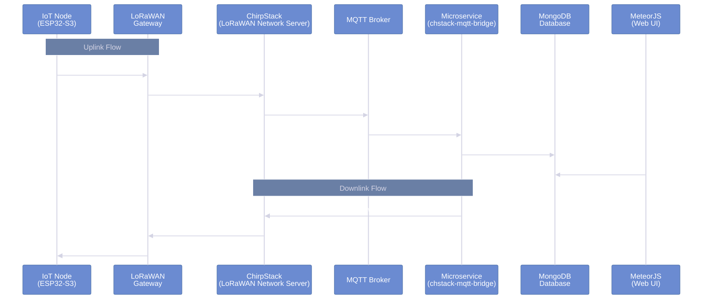
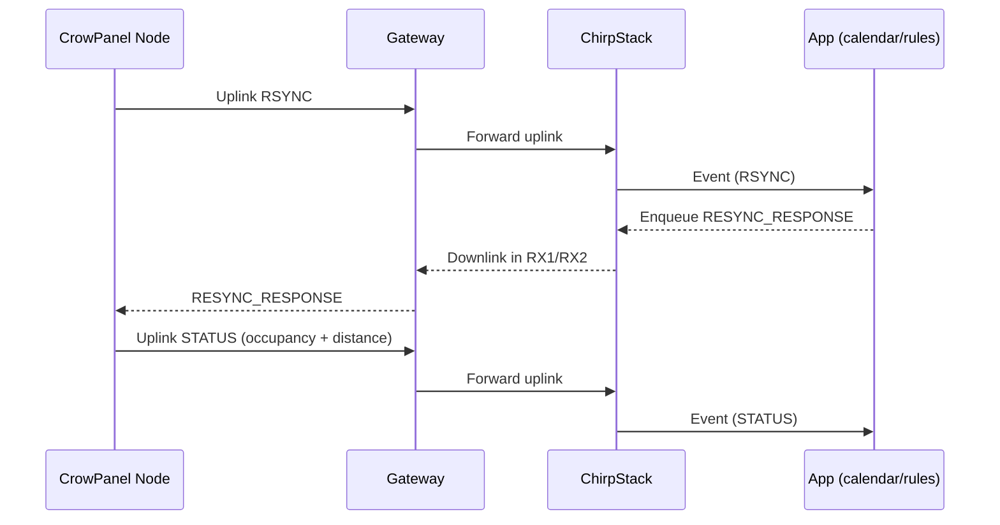

import { Alert } from "@/components/ui/alert";

# PARCAR-IoT: LoRaWAN IoT Node for Public Parking Spaces with Dynamic Remote Management

#### As part of the European **[UNCHAIN](https://unchainproject.eu/])** project, I developed a low-power IoT node designed to monitor public parking spaces and enable a remotely managed "dynamic use" model—allowing schedules, rules, and configuration updates without physical intervention.
##### The focus wasn't merely detecting occupancy, but transforming each parking space into an operable resource: measuring, communicating, receiving server-side configuration, and operating reliably in the field for extended periods on battery power.

> This post is written as a portfolio piece: it explains the solution at a high level, key technical decisions, and how it integrates with ChirpStack, without delving into sensitive details or proprietary code.

## Objectives

The system's goal was to provide public parking spaces with a digital operational cycle: knowing whether they're free or occupied, and being able to change permitted usage according to time slots or specific needs (rotation, loading/unloading, temporary reservations, etc.).

For this to work reliably in real-world conditions, two core capabilities were essential:
* **Reliable sensing** (without false positives)
* **Remote management** (updating schedules and calibration without reflashing firmware)

## System Architecture

The solution was built as a complete system with multiple interconnected components:

- **IoT Node**: sensing + local UI + power management
- **LoRaWAN Gateway**: receives uplinks and transmits downlinks via LoRa RF
- **ChirpStack**: LoRaWAN network server managing device registration, uplink processing, and downlink queuing
- **MQTT Broker**: message broker for event distribution between ChirpStack and application services
- **MongoDB Database**: persistent storage for device data, schedules, configurations, and telemetry
- **MeteorJS Application**: web-based platform for writing and managing data in MongoDB, providing user interface for configuration and monitoring
- **Docker Microservice (chstack-mqtt-bridge)**: dedicated service responsible for managing requests and responses between the server and the IoT node, handling protocol translation and command queuing

## Architecture Diagram



## The CrowPanel Node

The device combines:

- **ESP32‑S3** as the main MCU and lifecycle orchestrator (boot → measure → communicate → sleep)
- **SX1262 radio** for LoRaWAN communication
- **Ultrasonic sensor** to infer distance and determine occupancy based on configurable thresholds
- **E‑ink display** for local status and diagnostics (particularly useful during deployment and maintenance)

A significant part of the hardware integration work involved resolving pin mapping and bus conflicts (SPI) when multiple peripherals coexist (e‑ink/SD/radio), ensuring the design remains stable and reproducible.

## Firmware Architecture (Layered Design)

The firmware was organized in layers with a clear objective: **minimize awake time** and make behavior predictable.

- **Power/Boot/RTC**: state restoration and determining the "goal" of the current cycle
- **Sensor**: robust measurement when context requires it
- **Schedule**: active usage schedules/rules and associated configurations received remotely
- **LoRaWAN**: transmissions, downlink waiting, and retry control
- **UI**: e‑ink updates only when relevant state changes

## Lifecycle (Step by Step)

At a high level, the node operates as follows:

1. **Boot**: restore persisted state (schedule, thresholds, pending messages, counters)
2. **Decision**: determine whether to synchronize (RSYNC), retry a pending transmission, or execute a "normal" cycle
3. **Measurement**: perform ultrasonic measurement if current usage requires it or if state confirmation is needed for a transmission
4. **Uplink**: send RSYNC / STATUS / PING as appropriate
5. **Downlink**: process RESYNC_RESPONSE / ACK / REBOOT when received
6. **UI**: refresh e‑ink only if there's a real change (different hash)
7. **Deep sleep**: sleep for the calculated duration

## LoRaWAN Messaging Protocol

The protocol was designed with small, purpose-driven messages, separated by FPorts to simplify backend processing and debugging:

- **`RSYNC (uplink)`**: node requests synchronization; includes context so the server can calculate and return schedule/thresholds
- **`RSYNC_RESPONSE (downlink)`**: server returns timestamp/configuration, thresholds, and schedule entries; node persists and applies them
- **`STATUS (uplink)`**: reports distance/occupancy and metadata about active usage
- **`ACK/REBOOT (downlink)`**: confirmation and remote control for safe operation

### Typical Sequence (RSYNC → RESYNC_RESPONSE → STATUS)




## Occupancy Detection (Ultrasonic)

Occupancy is inferred from distance measurements, but with noise-resistant decision-making:

- Multiple readings are taken and the value is stabilized (median / outlier filtering)
- Readings are compared against **remotely configurable thresholds**, enabling site-specific calibration (height, tilt, reflections) without reflashing
- Measurement isn't always executed: it's activated only when the schedule/usage requires it or when pending messages depend on the state

## Low Power and Persistence

The power design is based on "transactions": wake up, do the minimum necessary, and go back to sleep.  
To make this viable, critical state is persisted in RTC memory (configuration, schedule, pending messages, hashes), so deep sleep reboots don't break logical continuity.

## Robustness: Retries and Pending Messages

In real-world environments, uplink/downlink losses occur, making retry logic essential:

- Important messages are marked as `pending_message` with a retry counter, persisted in RTC to survive resets
- The application clears the pending flag when the expected confirmation is received, or retries on a subsequent boot if it didn't arrive
- State hashes help prevent spam: if nothing changed, STATUS transmission and e‑ink refresh aren't forced

## Development and Testing (PlatformIO)

For development and bench testing, the typical workflow was:

```shell
platformio run --target upload
platformio device monitor --baud 115200
```

This allows validation of the lifecycle in logs (join/tx/rx/sleep), as well as debugging sensor calibration and retry behavior.

## Results and Impact

This work transforms a public parking space into a manageable asset: the backend defines usage schedules and the node applies rules and reports occupancy with minimal energy cost and true remote operation.  
As a portfolio piece, the main value lies in the end‑to‑end integration: hardware + low-power firmware + LoRaWAN + ChirpStack operation + calendar/management logic.

<Alert title="Future Improvements" type="note">
Natural next steps would include: advanced telemetry (RSSI/SNR/power consumption), calibration improvements, and deployment/configuration automation in ChirpStack to operate fleets with less friction.
</Alert>
