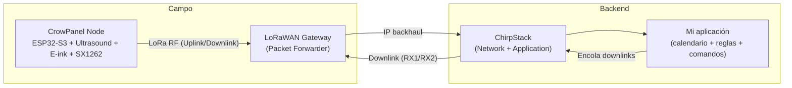

import { Alert } from "@/components/ui/alert";

# PARCAR-IoT: nodo IoT LoRaWAN para plazas públicas con gestión remota dinámica

#### Dentro del proyecto europeo **UNCHAIN**, desarrollé un nodo IoT de bajo consumo orientado a monitorizar plazas públicas de parking y habilitar un modelo de “uso dinámico” gestionado remotamente (horarios, reglas y configuración sin intervención física). El foco no era solo detectar ocupación, sino convertir cada plaza en un recurso operable: medir, comunicar, recibir configuración desde servidor y funcionar de forma estable en campo durante largos periodos con batería.

<Alert title={null} variant="default" className="!mt-4">
Este post está escrito como pieza de portfolio: explica la solución a alto nivel, las decisiones técnicas clave y cómo se integra con ChirpStack, sin entrar en detalles sensibles ni en código propietario.
</Alert>

## Qué se quería conseguir.

El objetivo del sistema era dotar a las plazas públicas de un ciclo operativo digital: saber si están libres/ocupadas y poder cambiar el uso permitido según franjas horarias o necesidades puntuales (rotación, carga/descarga, reservas temporales, etc.).
Para que esto funcione de verdad en calle, se necesitaban dos capacidades: 
* **sensado fiable** (sin falsos positivos)
* **gestión remota** (actualizar horarios y calibración sin reflashear firmware).

## La solución (visión sistema)

La solución se construyó como un sistema completo con tres piezas:

- **Nodo en campo** (CrowPanel): sensado + UI local + gestión energética. [memory:1]
- **Red LoRaWAN**: gateway(s) y servidor LoRaWAN con ChirpStack para recepción de uplinks y entrega de downlinks. [memory:11]
- **Aplicación / plataforma**: interpreta eventos, aplica lógica de calendario/uso y encola respuestas/comandos al nodo. [memory:5]

## Arquitectura (diagrama)




## El nodo CrowPanel (campo)

El dispositivo combina:

- **ESP32‑S3** como MCU principal y orquestador del ciclo de vida (boot → medir → comunicar → dormir). [memory:12]
- **Radio SX1262** para LoRaWAN. [memory:3]
- **Sensor ultrasónico** para inferir distancia y decidir ocupación a partir de thresholds. [memory:6]
- **Pantalla e‑ink** para estado local y diagnóstico (muy útil en despliegue y mantenimiento). [memory:1]

En términos de integración hardware, una parte importante del trabajo fue resolver el mapeo de pines y conflictos de buses (SPI) cuando conviven periféricos (e‑ink/SD/radio) y el diseño debe mantenerse estable y reproducible. [memory:4]

## Arquitectura de firmware (por capas)

El firmware se organizó en capas con un objetivo: **minimizar tiempo despierto** y hacer el comportamiento predecible. [memory:12]

- **Power/Boot/RTC**: restauración de estado y decisión del “objetivo” del ciclo actual. [memory:12]
- **Sensor**: medición robusta cuando el contexto lo requiere. [memory:6]
- **Schedule**: horarios/uso “activos” y reglas asociadas recibidas remotamente. [memory:5]
- **LoRaWAN**: envíos, espera de downlinks y control de reintentos. [memory:5]
- **UI**: actualización de e‑ink solo cuando cambia el estado relevante. [memory:18]

## Ciclo de vida (paso a paso)

A grandes rasgos, el nodo funciona así:

1. **Boot**: se restaura el estado persistido (schedule, thresholds, mensajes pendientes, contadores). [memory:12]
2. **Decisión**: se determina si toca sincronizar (RSYNC), reintentar un envío pendiente o ejecutar un ciclo “normal”. [memory:5]
3. **Medición**: se realiza medición ultrasónica si el uso actual lo requiere o si hay que confirmar estado para un envío. [memory:5][memory:6]
4. **Uplink**: se envía RSYNC / STATUS / PING según el caso. [memory:5]
5. **Downlink**: se procesa RESYNC_RESPONSE / ACK / REBOOT cuando llega. [memory:5]
6. **UI**: se refresca la e‑ink solo si hay cambio real (hash distinto). [memory:18]
7. **Deep sleep**: se duerme el tiempo calculado. [memory:12]

## Mensajería LoRaWAN (concepto)

El protocolo se diseñó con mensajes pequeños y con intención clara, separados por FPorts para simplificar backend y depuración:

- **RSYNC (uplink)**: el nodo pide sincronización; incluye contexto para que el servidor calcule y devuelva schedule/thresholds. [memory:5]
- **RESYNC_RESPONSE (downlink)**: el servidor devuelve timestamp/configuración, thresholds y entradas de schedule, y el nodo lo persiste y aplica. [memory:5]
- **STATUS (uplink)**: reporta distancia/ocupación y metadatos del uso activo. [memory:5]
- **ACK/REBOOT (downlink)**: confirmación y control remoto para operación segura. [memory:5]

### Secuencia típica (RSYNC → RESYNC_RESPONSE → STATUS)

```mermaid
sequenceDiagram
participant D as CrowPanel Node
participant G as Gateway
participant C as ChirpStack
participant A as App (calendario/reglas)

D->>G: Uplink RSYNC
G->>C: Forward uplink
C->>A: Evento (RSYNC)
A-->>C: Enqueue RESYNC_RESPONSE
C-->>G: Downlink en RX1/RX2
G-->>D: RESYNC_RESPONSE
D->>G: Uplink STATUS (ocupación + distancia)
G->>C: Forward uplink
C->>A: Evento (STATUS)
````


## Detección de ocupación (ultrasonidos)

La ocupación se infiere a partir de la distancia, pero evitando decisiones con ruido:

- Se toman varias lecturas y se estabiliza el valor (mediana / filtrado de outliers). [memory:6]
- Se comparan las lecturas contra thresholds **configurables remotamente**, lo que permite calibrar por emplazamiento (altura, inclinación, rebotes) sin reflashear. [memory:5]
- La medición no se ejecuta siempre: se activa solo si el schedule/uso lo requiere o si hay mensajes pendientes que dependen del estado. [memory:5]

## Bajo consumo y persistencia

El diseño de energía está basado en “transacciones”: despertar, hacer lo mínimo y volver a dormir. [memory:12]  
Para hacerlo viable, se persiste estado crítico en RTC (configuración, schedule, mensajes pendientes, hashes), de forma que los reboots por deep sleep no rompen la continuidad lógica. [memory:12]

## Robustez: reintentos y mensajes pendientes

En entornos reales hay pérdidas de uplink/downlink, por lo que la lógica de retries es esencial:

- Mensajes importantes se marcan como `pending_message` con contador de reintentos, persistido en RTC para sobrevivir resets. [memory:5]
- La aplicación limpia el pending cuando se recibe confirmación esperada, o reintenta en un boot posterior si no llegó. [memory:5]
- Los hashes de estado ayudan a evitar spam: si nada cambió, no se fuerza STATUS ni refresco de e‑ink. [memory:18]

## Operación y pruebas (PlatformIO)

Para desarrollo y bancada, el flujo de trabajo típico fue:

```bash
platformio run --target upload
platformio device monitor --baud 115200
```


Esto permite validar en logs el ciclo de vida (join/tx/rx/sleep), además de depurar calibración de sensor y comportamiento de reintentos. [memory:12]

## Resultado (por qué es relevante)

Este trabajo convierte una plaza pública en un activo gestionable: el backend define usos/horarios y el nodo aplica reglas y reporta ocupación con un coste energético mínimo y operación remota real. [memory:5][memory:11]  
Como pieza de portfolio, el valor principal está en la integración end‑to‑end: hardware + firmware low-power + LoRaWAN + operación con ChirpStack + lógica de calendario/gestión. [memory:1][memory:11]

---

<Alert title="Siguiente mejora (si se ampliara)" type="note">
En una evolución natural entrarían: telemetría avanzada (RSSI/SNR/consumo), mejoras de calibración, y automatización de despliegue/configuración en ChirpStack para operar flotas con menos fricción.
</Alert>
