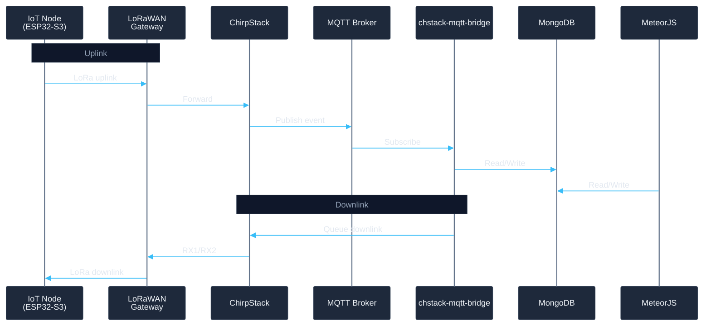
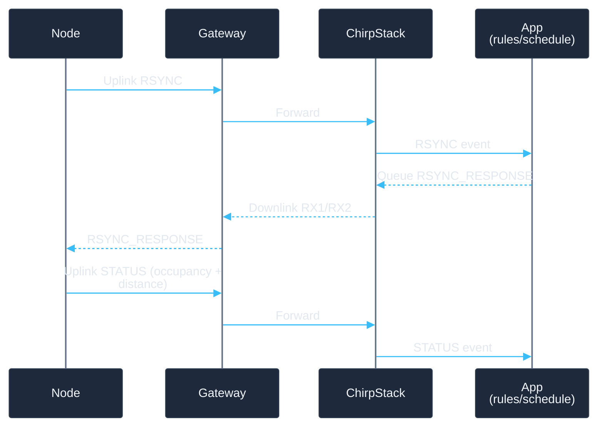

import { Alert } from "@/components/ui/alert";
import { CodeBlock } from "@/components/ui/code-block";

# PARCAR-IoT: LoRaWAN node for public parking

As part of the European **[UNCHAIN](https://unchainproject.eu/)** project, I built a low-power <Highlighter action="highlight" color="#86efac">IoT node</Highlighter> to monitor public parking spaces and support a <Highlighter action="underline" color="#fbbf24">dynamic use</Highlighter> model: change schedules, rules, and configuration remotely without touching the device. The goal was not only to detect free vs occupied, but to turn each space into a manageable resource—measuring, sending data, receiving server config, and running for long periods on <Highlighter action="box" color="#93c5fd">battery</Highlighter>.

> This post is a portfolio piece: it describes the solution at a high level, main technical choices, and ChirpStack integration, without sensitive or proprietary detail.

---

## System goals

The system had to give parking spaces a digital operational loop:

- Know at all times whether they are **free or occupied**.
- **Change allowed use** by time slot or need (rotation, loading zones, reservations, etc.).

To do this reliably in the field, two things were required:

1. **Reliable sensing** — no false positives.
2. **Remote management** — update schedules and calibration without reflashing firmware.

---

## Architecture overview

The solution is made of several components that talk to each other:

| Component | Role |
|-----------|------|
| **IoT node** | Sensing, e-ink UI, power management |
| **LoRaWAN gateway** | Receives uplinks, sends downlinks over LoRa radio |
| **ChirpStack** | LoRaWAN network server: devices, uplink handling, downlink queue |
| **MQTT broker** | Distributes events between ChirpStack and other services |
| **MongoDB** | Stores device data, schedules, config, telemetry |
| **MeteorJS app** | Web UI to manage and visualise everything |
| **chstack-mqtt-bridge** | Translates MQTT ↔ ChirpStack, queues commands to nodes |

**Data flow (short):**

- **Uplink:** Node → Gateway (LoRa) → ChirpStack → MQTT → apps & DB.
- **Downlink:** App / microservice → ChirpStack → Gateway → Node (LoRa).

---

## IoT node (hardware)

The device includes:

- **ESP32-S3** — Main MCU: boot, measure, communicate, deep sleep.
- **SX1262** — LoRa module for LoRaWAN.
- **JSN-SR04T** — Ultrasonic sensor for distance and occupancy via configurable thresholds.
- **E-ink display** — Shows occupancy and usage schedule.

The board used was an **ESP32-S3 DevKitC-1** with a custom PCB (e-ink + microSD slot). To avoid SPI bus conflicts (e-ink, radio), the **arduino-lmic** library was patched to use the `SPI3` class instead of the default `SPI`.

---

## Sending a LoRaWAN uplink

The firmware uses **LMIC** (arduino-lmic) for uplinks. The pattern is always the same: **build a byte payload, set an FPort, and call the send function**. ChirpStack and your app can then tell message type (RSYNC, STATUS, PING, etc.) from the FPort.

Below is a minimal example of sending a **STATUS** message: measured distance and occupancy (2 bytes + 1 byte) on FPort 2.

<CodeBlock
  code={`#include <lmic.h>
#include <hal/hal.h>

// Protocol FPorts (example)
#define FPORT_RSYNC   1
#define FPORT_STATUS  2
#define FPORT_PING    3

// Send a STATUS uplink: distance (cm) + occupied (0 free, 1 occupied)
void sendStatusUplink(uint16_t distanceCm, bool occupied) {
    if (LMIC.opmode & OP_TXRXPEND)
        return;

    uint8_t payload[3];
    payload[0] = (uint8_t)(distanceCm >> 8);   // distance high byte
    payload[1] = (uint8_t)(distanceCm & 0xFF);  // distance low byte
    payload[2] = occupied ? 1 : 0;

    LMIC_setTxData2(FPORT_STATUS, payload, sizeof(payload), false);
}

void loop() {
    os_runloop_once();

    if (shouldSendStatus) {
        uint16_t dist = readDistanceCm();
        bool occ = (dist < occupiedThresholdCm);
        sendStatusUplink(dist, occ);
        shouldSendStatus = false;
    }
}`}
  language="cpp"
  variant="terminal"
  theme="oneDark"
  showLineNumbers={true}
  copyable={true}
  showLanguage={true}
  title="LoRaWAN uplink with LMIC (STATUS)"
/>

**Notes:**

- **`LMIC_setTxData2(fport, payload, len, confirmed)`** — queues the uplink; last arg = request ACK downlink.
- **FPort** — application port (1–223). Backend filters by FPort to handle RSYNC, STATUS, etc.
- **Payload** — bytes only. Here: 2 bytes distance (big-endian) + 1 byte occupancy. You can extend with counters, checksums, etc.

In ChirpStack these uplinks show in the console and are republished over MQTT to your app or microservice.

---

## Firmware: layers and lifecycle

The firmware is split into **layers** to minimise awake time and keep behaviour predictable and power-efficient:

- **Power / boot / RTC** — Restore state and decide the goal of the current cycle.
- **Sensor** — Stable measurement (multiple reads, outlier filtering).
- **Schedule** — Active rules and config received via downlink.
- **LoRaWAN** — Uplinks, downlink wait, retries.
- **UI** — E-ink refresh only when state actually changes.

**Lifecycle (short):**

1. **Boot** — Restore saved state (schedule, thresholds, pending messages).
2. **Decide** — RSYNC, retry pending, or normal cycle.
3. **Measure** — If needed, read distance and derive occupancy.
4. **Uplink** — Send RSYNC, STATUS, or PING as appropriate.
5. **Downlink** — Handle RSYNC_RESPONSE, ACK, REBOOT if received.
6. **UI** — Refresh e-ink only if state hash changed.
7. **Deep sleep** — Sleep until next cycle.

---

## Message protocol (FPorts)

Messages are small and separated by **FPort** so the backend can route them easily:

| Direction | FPort / type | Description |
|-----------|--------------|-------------|
| Uplink | **RSYNC** | Node asks for sync; server replies with time, thresholds, schedule. |
| Downlink | **RSYNC_RESPONSE** | Server sends config; node stores and applies it. |
| Uplink | **STATUS** | Distance, occupancy, and metadata for current use. |
| Downlink | **ACK / REBOOT** | Confirmation or reboot command. |

Typical sequence (RSYNC → response → STATUS):

---

## MeteorJS application

**MeteorJS** is a full-stack JavaScript framework with real-time sync between client and server and MongoDB by default. It fits dashboards and config UIs because the interface updates automatically when data changes.

In this project the Meteor app is used to:

- **Manage devices** — Registration, metadata, location, LoRaWAN credentials.
- **Configure schedules and rules** — When a space is available, reserved, or has special rules.
- **Tune thresholds** — Remote calibration of occupancy detection (no reflash).
- **Monitor in real time** — Node status and telemetry.
- **Queue downlinks** — e.g. reboot or config updates.

---

## Occupancy detection

Occupancy is **derived from distance** from the ultrasonic sensor, with noise-resistant logic:

- **Multiple readings** are taken and stabilised (median or outlier filtering).
- Readings are compared to **remotely configurable thresholds**, so each site can be calibrated (height, tilt, reflections) without reflashing.
- Measurement is **not every cycle** — only when the schedule requires it or when a pending message depends on state.

---

## Low power and robustness

- **Power:** The design is “transactional”: wake up, do the minimum, sleep again. Critical state (config, schedule, pending messages, hashes) is stored in **RTC memory** so deep-sleep restarts do not break logic.
- **Robustness:** Important messages are marked **pending** with a retry count; if no confirmation arrives, they are retried on the next cycle. **State hashes** avoid sending STATUS or refreshing e-ink when nothing changed.

---

## Results and next steps

The system turns a parking space into a manageable asset: the backend defines schedules and rules, and the node applies them and reports occupancy with low power and true remote operation.

As a portfolio piece, the value is in **end-to-end integration**: hardware, low-power firmware, LoRaWAN, ChirpStack, and calendar/management logic.

Natural next steps: better per-site calibration and ChirpStack deployment/configuration automation to run fleets with less friction.
