# Building a Modern Web Application: A Comprehensive Guide

This is a comprehensive guide to building modern web applications with React, TypeScript, and modern tooling. We'll explore various concepts, best practices, and showcase different types of content including code examples, images, and detailed explanations.

## Introduction to Modern Web Development

Modern web development has evolved significantly over the past decade. Today's applications require robust architecture, type safety, and excellent developer experience. In this guide, we'll dive deep into the technologies and patterns that make modern web applications scalable and maintainable.

## React and Component Architecture

React has revolutionized how we think about building user interfaces. Components are the building blocks of React applications, and understanding how to structure them effectively is crucial for building maintainable applications.

### Functional Components with Hooks

Modern React development primarily uses functional components with hooks. Here's a comprehensive example of a custom hook for data fetching:

```javascript
import { useState, useEffect, useCallback } from 'react';

function useDataFetcher(url) {
  const [data, setData] = useState(null);
  const [loading, setLoading] = useState(true);
  const [error, setError] = useState(null);

  const fetchData = useCallback(async () => {
    try {
      setLoading(true);
      setError(null);
      const response = await fetch(url);
      
      if (!response.ok) {
        throw new Error(`HTTP error! status: ${response.status}`);
      }
      
      const result = await response.json();
      setData(result);
    } catch (err) {
      setError(err.message);
    } finally {
      setLoading(false);
    }
  }, [url]);

  useEffect(() => {
    fetchData();
  }, [fetchData]);

  const refetch = useCallback(() => {
    fetchData();
  }, [fetchData]);

  return { data, loading, error, refetch };
}

export default useDataFetcher;
```

This custom hook demonstrates several important React patterns:
- State management with `useState`
- Side effects with `useEffect`
- Memoization with `useCallback`
- Error handling
- Loading states

### Advanced State Management

For complex applications, you might need more sophisticated state management. Here's an example using React Context and useReducer:

```javascript
import React, { createContext, useContext, useReducer } from 'react';

const AppStateContext = createContext();
const AppDispatchContext = createContext();

function appReducer(state, action) {
  switch (action.type) {
    case 'SET_USER':
      return { ...state, user: action.payload };
    case 'SET_THEME':
      return { ...state, theme: action.payload };
    case 'ADD_NOTIFICATION':
      return {
        ...state,
        notifications: [...state.notifications, action.payload]
      };
    case 'REMOVE_NOTIFICATION':
      return {
        ...state,
        notifications: state.notifications.filter(
          n => n.id !== action.payload
        )
      };
    default:
      throw new Error(`Unhandled action type: ${action.type}`);
  }
}

const initialState = {
  user: null,
  theme: 'light',
  notifications: []
};

export function AppProvider({ children }) {
  const [state, dispatch] = useReducer(appReducer, initialState);

  return (
    <AppStateContext.Provider value={state}>
      <AppDispatchContext.Provider value={dispatch}>
        {children}
      </AppDispatchContext.Provider>
    </AppStateContext.Provider>
  );
}

export function useAppState() {
  const context = useContext(AppStateContext);
  if (!context) {
    throw new Error('useAppState must be used within AppProvider');
  }
  return context;
}

export function useAppDispatch() {
  const context = useContext(AppDispatchContext);
  if (!context) {
    throw new Error('useAppDispatch must be used within AppProvider');
  }
  return context;
}
```

## TypeScript Best Practices

TypeScript adds static typing to JavaScript, making your code more robust and maintainable. Here are some advanced TypeScript patterns:

### Generic Components

```typescript
interface ListProps<T> {
  items: T[];
  renderItem: (item: T) => React.ReactNode;
  keyExtractor: (item: T) => string;
}

function List<T>({ items, renderItem, keyExtractor }: ListProps<T>) {
  return (
    <ul>
      {items.map(item => (
        <li key={keyExtractor(item)}>
          {renderItem(item)}
        </li>
      ))}
    </ul>
  );
}

// Usage
interface User {
  id: string;
  name: string;
  email: string;
}

function UserList({ users }: { users: User[] }) {
  return (
    <List
      items={users}
      keyExtractor={user => user.id}
      renderItem={user => (
        <div>
          <h3>{user.name}</h3>
          <p>{user.email}</p>
        </div>
      )}
    />
  );
}
```

### Utility Types and Mapped Types

```typescript
// Partial makes all properties optional
type PartialUser = Partial<User>;

// Pick selects specific properties
type UserPreview = Pick<User, 'id' | 'name'>;

// Omit removes specific properties
type UserWithoutEmail = Omit<User, 'email'>;

// Custom mapped type for making all properties readonly
type ReadonlyUser = {
  readonly [K in keyof User]: User[K];
};

// Conditional types
type NonNullable<T> = T extends null | undefined ? never : T;

// Extract specific types
type StringKeys<T> = {
  [K in keyof T]: T[K] extends string ? K : never;
}[keyof T];
```

## Performance Optimization

Performance is crucial for modern web applications. Here are some techniques for optimizing React applications:

### Memoization Strategies

```javascript
import { memo, useMemo, useCallback } from 'react';

// Memoize expensive calculations
function ExpensiveComponent({ items, filter }) {
  const filteredItems = useMemo(() => {
    return items.filter(item => 
      item.name.toLowerCase().includes(filter.toLowerCase())
    );
  }, [items, filter]);

  // Memoize callbacks to prevent unnecessary re-renders
  const handleClick = useCallback((id) => {
    console.log('Clicked:', id);
  }, []);

  return (
    <div>
      {filteredItems.map(item => (
        <Item 
          key={item.id} 
          item={item} 
          onClick={handleClick}
        />
      ))}
    </div>
  );
}

// Memoize components
const Item = memo(function Item({ item, onClick }) {
  return (
    <div onClick={() => onClick(item.id)}>
      <h3>{item.name}</h3>
      <p>{item.description}</p>
    </div>
  );
});
```

### Code Splitting and Lazy Loading

```javascript
import { lazy, Suspense } from 'react';

// Lazy load components
const HeavyComponent = lazy(() => import('./HeavyComponent'));
const Dashboard = lazy(() => import('./Dashboard'));

function App() {
  return (
    <Suspense fallback={<div>Loading...</div>}>
      <Router>
        <Routes>
          <Route path="/" element={<Home />} />
          <Route 
            path="/dashboard" 
            element={
              <Suspense fallback={<DashboardSkeleton />}>
                <Dashboard />
              </Suspense>
            } 
          />
          <Route 
            path="/heavy" 
            element={
              <Suspense fallback={<LoadingSpinner />}>
                <HeavyComponent />
              </Suspense>
            } 
          />
        </Routes>
      </Router>
    </Suspense>
  );
}
```

## Testing Strategies

Testing is an essential part of modern web development. Here's how to structure comprehensive tests:

### Unit Testing with Jest and React Testing Library

```javascript
import { render, screen, fireEvent, waitFor } from '@testing-library/react';
import { useDataFetcher } from './useDataFetcher';

// Mock fetch
global.fetch = jest.fn();

describe('useDataFetcher', () => {
  beforeEach(() => {
    fetch.mockClear();
  });

  it('should fetch data successfully', async () => {
    const mockData = { id: 1, name: 'Test' };
    fetch.mockResolvedValueOnce({
      ok: true,
      json: async () => mockData,
    });

    const { result } = renderHook(() => useDataFetcher('/api/data'));

    expect(result.current.loading).toBe(true);

    await waitFor(() => {
      expect(result.current.loading).toBe(false);
    });

    expect(result.current.data).toEqual(mockData);
    expect(result.current.error).toBe(null);
  });

  it('should handle errors', async () => {
    fetch.mockRejectedValueOnce(new Error('Network error'));

    const { result } = renderHook(() => useDataFetcher('/api/data'));

    await waitFor(() => {
      expect(result.current.loading).toBe(false);
    });

    expect(result.current.error).toBe('Network error');
    expect(result.current.data).toBe(null);
  });
});
```

## Image Handling

Modern web applications often need to handle images efficiently. Here are some best practices:


When working with images in React, consider:
- Lazy loading for performance
- Responsive images with srcset
- Image optimization and compression
- Using modern formats like WebP

## System Architecture

Here's an example of a typical React application architecture using Mermaid:

```mermaid
graph TD
    A[User Interface] --> B[React Components]
    B --> C[State Management]
    C --> D[API Layer]
    D --> E[Backend Services]
    E --> F[Database]
    
    B --> G[Custom Hooks]
    G --> H[Business Logic]
    H --> I[Data Processing]
    
    style A fill:#4ec9b0
    style B fill:#1a1a1a
    style C fill:#808080
    style D fill:#1a1a1a
    style E fill:#808080
    style F fill:#1a1a1a
```



This diagram illustrates the flow of data and components in a modern React application.

## Advanced Patterns

### Custom Hooks Composition

```javascript
function useLocalStorage(key, initialValue) {
  const [storedValue, setStoredValue] = useState(() => {
    try {
      const item = window.localStorage.getItem(key);
      return item ? JSON.parse(item) : initialValue;
    } catch (error) {
      console.error(error);
      return initialValue;
    }
  });

  const setValue = useCallback((value) => {
    try {
      const valueToStore = value instanceof Function ? value(storedValue) : value;
      setStoredValue(valueToStore);
      window.localStorage.setItem(key, JSON.stringify(valueToStore));
    } catch (error) {
      console.error(error);
    }
  }, [key, storedValue]);

  return [storedValue, setValue];
}

// Composing hooks
function useUserPreferences() {
  const [theme, setTheme] = useLocalStorage('theme', 'light');
  const [language, setLanguage] = useLocalStorage('language', 'en');
  
  return {
    theme,
    setTheme,
    language,
    setLanguage,
  };
}
```

## Conclusion

Building modern web applications requires understanding multiple concepts and patterns. From component architecture to performance optimization, each aspect plays a crucial role in creating maintainable and scalable applications.

Key takeaways:
- Use functional components with hooks
- Implement proper TypeScript types
- Optimize performance with memoization
- Write comprehensive tests
- Follow best practices for images and assets

Remember, the best code is not just working code, but code that is maintainable, testable, and scalable.

